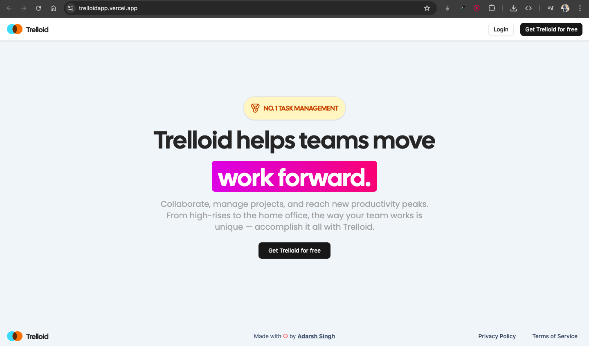
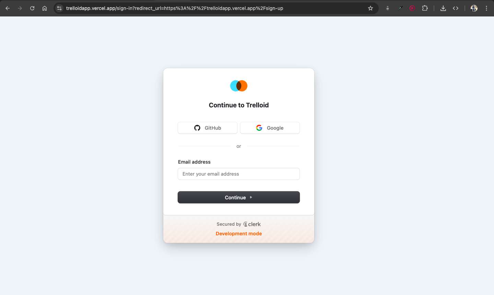
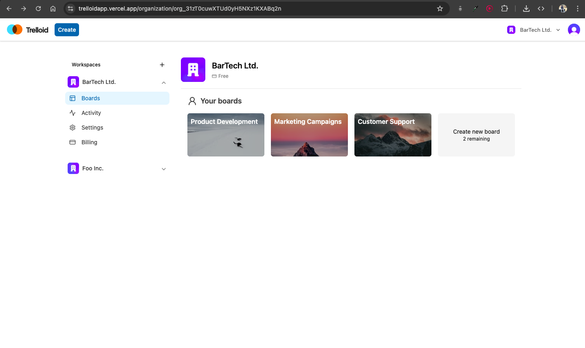
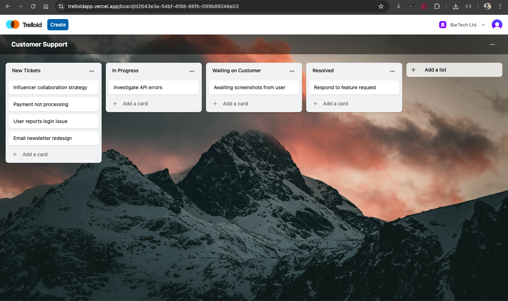
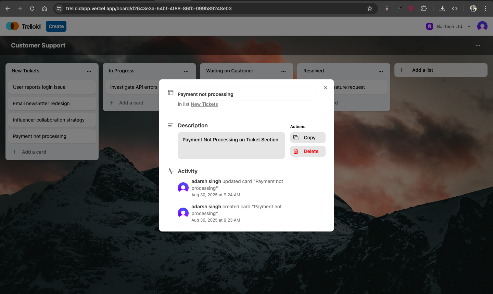
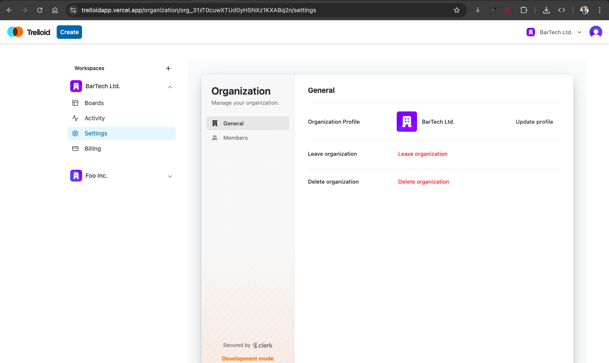
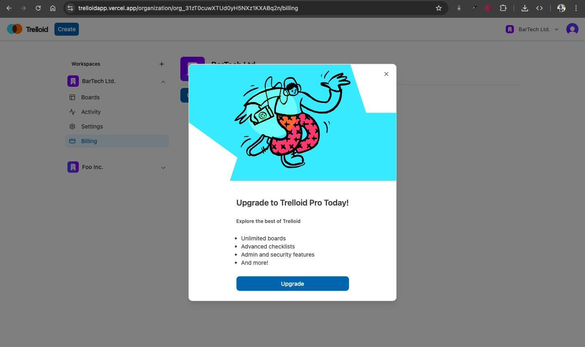

# Trelloid

Trelloid is a modern B2B SaaS project management platform designed to help teams and organizations collaborate, organize tasks, and manage workflows with boards, lists, and cards.

**🌐 Live Demo:** [Access Trelloid](https://trelloidapp.vercel.app)  
**🎬 Project Walkthrough:** [Watch on YouTube](https://youtube.com/your-video-link)

## ✅ Core Features

- 🏢 **Organizations & Workspaces** – Manage multiple team workspaces efficiently.  
- 📋 **Boards & Lists** – Organize projects and tasks with flexible boards and lists.  
- 📝 **Cards & Task Management** – Add tasks and details seamlessly within boards.  
- 🔄 **Drag & Drop** – Reorder boards, lists, and cards intuitively.  
- 📊 **Activity & Audit Logs** – Track team actions and project history.  
- 💳 **SaaS Subscription Model** – Limit boards per organization with Stripe billing, with unlock options.  
- 🤝 **Collaboration** – Invite team members and manage roles effortlessly.  


## 🛠 Tech Stack

### **Client (Frontend)**

- ⚛️ **Next.js** – React-based framework for server-side rendering and dynamic client-side interactivity
- 🎨 **TailwindCSS, Lucide Icons, Shadcn UI, Animate.css**
- 📝 **React Hook Form & Yup** – Form handling and validation
- 🔄 **Zustand** – Efficient state management
- 🌐 **Axios** – API requests and data fetching
- 🔔 **Sonner & Tailwind Merge** – Notifications and utility helpers
- 🔒 **Clerk** – Authentication and user management

### **Server (Backend)**

- ⚡ **Express.js** – Lightweight and flexible Node.js backend framework
- 🗄 **PostgreSQL + Prisma ORM** – Relational database with schema management
- 🔒 **Clerk (Express integration)** – Authentication and user management
- 💳 **Stripe** – Payment processing and subscription management
- 🔗 **Svix & Unsplash API** – Webhooks and third-party integrations
- 🛡 **Zod, Body-Parser, CORS** – Request validation, parsing, and security
- 🌱 **Dotenv** – Environment variable management
- 🔧 **Nodemon, ts-node, TypeScript** – Development tooling and type safety
- 🌐 **Ngrok** – Secure tunneling for local development and testing

### **📦 Monorepo**

- Frontend (`web`) and Backend (`api`) are managed in a single monorepo for **shared configurations, consistent types, and streamlined development workflow**

## Environment Variables

To run this project, you will need to set the following environment variables in your `.env` file:

- `DATABASE_URL`
- `DIRECT_URL`
- `FRONTEND_URL`
- `PORT`
- `CLERK_PUBLISHABLE_KEY`
- `CLERK_SECRET_KEY`
- `CLERK_WEBHOOK_SECRET_USER`
- `CLERK_WEBHOOK_SECRET_ORG`
- `CLERK_WEBHOOK_SIGNING_SECRET`
- `NEXT_PUBLIC_CLERK_PUBLISHABLE_KEY`
- `NEXT_PUBLIC_CLERK_SIGN_IN_URL`
- `NEXT_PUBLIC_CLERK_SIGN_IN_FALLBACK_REDIRECT_URL`
- `NEXT_PUBLIC_CLERK_SIGN_UP_FALLBACK_REDIRECT_URL`
- `UNSPLASH_ACCESS_KEY`
- `STRIPE_SECRET_KEY`
- `STRIPE_WEBHOOK_SECRET`
- `NEXT_PUBLIC_API_URL`

## Installation & Running Locally

Follow these steps to set up and run Trelloid on your local machine:

```bash
# Clone the repository
git clone https://github.com/devadarshh/trelloid.git
cd trelloid

# Install frontend dependencies
cd frontend
npm install

# Install backend dependencies
cd ../backend
npm install

# Return to the root directory
cd ..

# Run both frontend and backend concurrently
npm run dev
## Screenshots

## 📸 Screenshots

### Landing Page


### Sign In Page



### Organization Page


### Board Page


### Card Page


### Settings Page


### Billing Page


### Activity Page

```
